# Dairi — Arquitectura AWS

> Generado a partir de una inspección en vivo de la cuenta AWS (`563583517844`, `us-east-1`) y del código del repositorio. Refleja el estado real desplegado, no solo lo documentado en `CLAUDE.md` — durante esta revisión se encontraron varias discrepancias entre lo documentado/asumido y lo realmente en producción (ver **Correcciones encontradas** al final).

## Diagrama

```mermaid
flowchart TB
    subgraph CLIENT["🌐 Cliente"]
        Browser["Navegador<br/>Angular SPA"]
    end

    subgraph EDGE["Edge / Static hosting"]
        CF["CloudFront<br/>(dairi.cl, HTTPS)"]
        S3Web["S3: friquelme-firstpage<br/>build Angular + patient-docs/"]
    end

    subgraph APIGW["API Gateway — HTTP API (cwhwahvqr0)"]
        GW["dairi<br/>protocolo HTTP (v2)"]
    end

    subgraph VPC["🔒 VPC vpc-0e99bc3b783e6f17c — 6 subnets privadas, SIN NAT Gateway"]
        direction TB
        LOGIN["λ login<br/>(lambda-auth)<br/>register/login/activate/refresh"]
        BFF["λ dairi-bff<br/>(lambda-dairi-bff)<br/>BFF principal autenticado"]
        BOOK["λ dairi-book<br/>(lambda-book)<br/>reserva pública + pagos"]
        DBACCESS["λ db-access<br/>diagnóstico interno, sin JWT"]
        RDS[("RDS PostgreSQL<br/>database-dairi<br/>⏸ normalmente apagada")]

        EPDDB{{"VPC Gateway Endpoint<br/>DynamoDB ✅ gratis"}}
        EPS3{{"VPC Gateway Endpoint<br/>S3 ⏳ pendiente"}}

        LOGIN -->|"SQL"| RDS
        BFF -->|"SQL"| RDS
        BOOK -->|"SQL"| RDS
        DBACCESS -->|"SQL crudo"| RDS
    end

    subgraph NOVPC["Lambdas fuera de VPC — egress directo a internet"]
        PAYMENT["λ dairi-payment<br/>crea/consulta pagos Flow"]
        SOAP["λ dairi-soap-processor<br/>parsea SOAP.md → BFF"]
        TRANSCRIBE["λ transcribe-nova-3<br/>audio → Deepgram → Bedrock"]
        AUDIO["λ dairi-audio<br/>URLs prefirmadas grabaciones"]
        SENDEMAIL["λ send-email<br/>envío de correos (SES)"]
        HELPDESK["λ dairi-helpdesk<br/>helpdesk + chat equipo<br/>escribe DynamoDB directo"]
        HELPWORKER["λ dairi-helpdesk-worker<br/>⚰️ sin tráfico real, ver nota"]
    end

    subgraph DATA["Datos"]
        DDB_HD[("DynamoDB<br/>dairi-helpdesk<br/>(chat equipo + soporte)")]
        DDB_ACC[("DynamoDB<br/>dairi-agenda-accounts<br/>(plan Starter gratis)")]
        DDB_APPT[("DynamoDB<br/>dairi-agenda-appointments<br/>(plan Starter gratis)")]
        S3AUDIO[("S3: budget-riquelmetapia<br/>recordings/*.webm")]
        SQSQ[["SQS<br/>dairi-helpdesk-messages"]]
    end

    subgraph EXT["Servicios externos"]
        FLOW["Flow.cl<br/>(pasarela de pago, producción real)"]
        DEEPGRAM["Deepgram Nova-3<br/>(transcripción)"]
        BEDROCK["Amazon Bedrock<br/>Nova Lite<br/>(SOAP + resumen IA)"]
        GMEET["Google Calendar / Meet<br/>(meet-link por cita)"]
    end

    Browser -->|"HTTPS"| CF --> S3Web
    Browser -->|"fetch /api/*<br/>Bearer JWT"| GW

    GW -->|"/api/auth/*"| LOGIN
    GW -->|"/api/entities/*, /api/admin/*,<br/>/api/chat/*, /api/agenda/*,<br/>/api/documents/*, /api/clinical-summary/*,<br/>/api/suppliers/*"| BFF
    GW -->|"/api/book/*, /api/webhook/flow"| BOOK
    GW -->|"/api/audio-recordings/*"| AUDIO
    GW -->|"/api/send-email"| SENDEMAIL
    GW -->|"/api/helpdesk/message"| HELPDESK

    LOGIN -.->|"DynamoDB<br/>(plan agenda)"| EPDDB
    BFF -.->|"DynamoDB<br/>(chat equipo, agenda)"| EPDDB
    BOOK -.->|"DynamoDB<br/>(fallback plan agenda)"| EPDDB
    EPDDB --> DDB_HD
    EPDDB --> DDB_ACC
    EPDDB --> DDB_APPT

    BFF -.->|"S3 (documentos)<br/>⏳ colgado sin el endpoint"| EPS3
    EPS3 -.-> S3Web

    HELPDESK -->|"PutItem directo"| DDB_HD
    HELPDESK -.->|"⚰️ sin uso real"| SQSQ
    SQSQ -.->|"trigger, sin mensajes"| HELPWORKER
    HELPWORKER -.-> DDB_HD

    BOOK <-->|"HTTPS<br/>relay firmado HMAC"| PAYMENT
    PAYMENT <-->|"API REST"| FLOW

    S3AUDIO -.->|"S3 trigger *.webm"| TRANSCRIBE
    TRANSCRIBE --> DEEPGRAM
    TRANSCRIBE --> BEDROCK
    TRANSCRIBE -->|"escribe .soap.md"| S3AUDIO
    S3AUDIO -.->|"S3 trigger *.md"| SOAP
    SOAP -->|"HTTPS + JWT superadmin"| BFF

    AUDIO -.-> S3AUDIO
    BOOK -.->|"meet-link"| GMEET

    classDef vpcBox fill:#fff3e0,stroke:#e65100,stroke-width:2px
    classDef novpcBox fill:#e8f5e9,stroke:#2e7d32,stroke-width:2px
    classDef dataBox fill:#e3f2fd,stroke:#1565c0,stroke-width:2px
    classDef extBox fill:#f3e5f5,stroke:#6a1b9a,stroke-width:2px
    classDef pending fill:#ffebee,stroke:#c62828,stroke-width:2px,stroke-dasharray: 5 5

    class LOGIN,BFF,BOOK,DBACCESS,RDS,EPDDB vpcBox
    class PAYMENT,SOAP,TRANSCRIBE,AUDIO,SENDEMAIL,HELPDESK novpcBox
    class DDB_HD,DDB_ACC,DDB_APPT,S3AUDIO,S3Web dataBox
    class FLOW,DEEPGRAM,BEDROCK,GMEET extBox
    class EPS3,SQSQ,HELPWORKER pending
```

## Componentes

### Frontend
- **Angular SPA** — build estático servido desde S3 (`friquelme-firstpage`) detrás de **CloudFront** en `dairi.cl` (HTTPS con dominio propio — S3 solo no lo permite sin CDN delante).
- Mismo bucket aloja `patient-docs/` (documentos clínicos, acceso restringido vía URL prefirmada, nunca público).

### API Gateway
- **`dairi`** (`cwhwahvqr0`) — **HTTP API** (protocolo v2, no REST API v1). Este dato importa: HTTP API no soporta integración directa con servicios AWS (S3, DynamoDB) vía plantillas VTL como sí lo hace REST API — por eso cualquier operación contra S3/DynamoDB necesita pasar por un Lambda, no puede resolverse "gratis" a nivel de API Gateway.

### Lambdas dentro de la VPC (`vpc-0e99bc3b783e6f17c`, sin NAT Gateway)
| Lambda (AWS) | Directorio | Rol |
|---|---|---|
| `login` | `lambda-auth` | Registro, login, activación, refresh, logout. Rutas Postgres + rama DynamoDB para el plan agenda. |
| `dairi-bff` | `lambda-dairi-bff` | BFF autenticado: entidades genéricas, admin, chat de equipo, calendario del plan agenda, resumen clínico IA, documentos. |
| `dairi-book` | `lambda-book` | Reserva pública de citas (todos los planes) + orquestación de pago con Flow + `meet-link`. |
| `db-access` | — | Diagnóstico interno, SQL crudo, sin JWT — auxiliar, se elimina antes de vender el software. |

Al estar en esta VPC sin NAT, **solo tienen ruta de salida a los servicios AWS que tengan un VPC Gateway Endpoint asociado** — hoy DynamoDB (✅) y, si el usuario lo crea, S3 (⏳). Bedrock no tiene opción de Gateway Endpoint gratuito (solo Interface Endpoint, pago), por eso ningún Lambda de la VPC lo llama directamente.

### Lambdas fuera de la VPC (egress directo a internet)
| Lambda (AWS) | Directorio | Rol |
|---|---|---|
| `dairi-payment` | `lambda-payment` | Crea y consulta pagos en Flow.cl; relay firmado (HMAC) hacia `dairi-book` con el resultado ya verificado. |
| `dairi-soap-processor` | `lambda-soap-processor` | Trigger S3 en `recordings/*.md` → parsea SOAP → llama a `dairi-bff` con un JWT de servicio `role:superadmin`. |
| `transcribe-nova-3` | `lambda-transcribe` | Trigger S3 en `recordings/*.webm` → Deepgram (transcripción) → Bedrock Nova Lite (nota SOAP + resumen) → escribe `.soap.md`. |
| `dairi-audio` | `lambda-audio` | URLs prefirmadas S3 para subir/descargar grabaciones de audio. |
| `send-email` | — | Envío de correos transaccionales (activación de cuenta, etc.). |
| `dairi-helpdesk` | `lambda-helpdesk` | Atiende `POST /api/helpdesk/message` — escribe **directo** en DynamoDB (sin SQS). También contiene lógica para `/api/chat/messages`, pero esas rutas nunca le llegan (API Gateway las manda a `dairi-bff`), así que esa parte del código está inactiva en producción. |
| `dairi-helpdesk-worker` | `lambda-helpdesk-worker` | Consumidor de `dairi-helpdesk-messages` (SQS) — el event source mapping está `Enabled`, pero nada le publica mensajes hoy. Infraestructura sin uso real, candidata a limpieza. |

### Datos
- **RDS PostgreSQL** `database-dairi` — normalmente apagada, solo dentro de la VPC.
- **DynamoDB**: `dairi-helpdesk` (chat de equipo + mensajes de soporte), `dairi-agenda-accounts` (cuentas del plan Starter gratis), `dairi-agenda-appointments` (agenda del plan Starter gratis).
- **S3**: `friquelme-firstpage` (frontend + documentos de pacientes), `budget-riquelmetapia` (grabaciones de audio).
- **SQS**: `dairi-helpdesk-messages`.

### Servicios externos
- **Flow.cl** — pasarela de pago (cuenta de producción real).
- **Deepgram Nova-3** — transcripción de audio.
- **Amazon Bedrock (Nova Lite)** — generación de nota SOAP + resumen narrativo.
- **Google Calendar / Meet** — enlace de videoconsulta por cita (`meet-link`).

### Autenticación
JWT (`HS256`) con dos flujos paralelos:
- **Planes Pro/Enterprise (Postgres)**: `app_user` + `professional` + `user_schema`/`app_schema`. Roles `admin`/`professional`/`receptionist`/`staff`/`viewer`/`superadmin`. `superadmin` es el único bypass total de scoping por fila (row-level); `admin` solo salta el chequeo de módulo, no el de fila (corregido hoy — antes cualquier cuenta sin fila en `professional` veía la tabla completa).
- **Plan Starter/agenda (DynamoDB)**: cuentas 100% aisladas de Postgres. JWT lleva `accountType:'agenda'`; el router de `dairi-bff` bloquea por defecto cualquier ruta que no sea la agenda propia (`deny-by-default`), sin depender de `role`.

## Correcciones encontradas durante esta revisión

Al inspeccionar el mapeo real de rutas de API Gateway (`get-routes` + `get-integrations`), aparecieron dos discrepancias importantes respecto a lo que se había entendido antes en la sesión:

1. **`POST /api/helpdesk/message` NO va a `dairi-bff`** — va directo a `dairi-helpdesk`. La rama `chatHandler.mjs` dentro de `dairi-bff` que atiende ese mismo path existe en el código pero **nunca recibe tráfico real** (API Gateway no la enruta ahí).
   **Corrección sobre la marcha** (verificado bajando el código realmente desplegado, no solo el del repo): `dairi-helpdesk` escribe **directo a DynamoDB**, sin pasar por SQS en absoluto — el código del repo (`lambda-helpdesk/index.mjs`) estaba desincronizado de lo que corre en AWS (alguien desplegó una reimplementación distinta sin subirla a git). Ya se sincronizó el repo con el código real. El pipeline `dairi-helpdesk-messages` (SQS) + `dairi-helpdesk-worker` sigue existiendo y con su trigger `Enabled`, pero **no recibe tráfico real de ningún productor** — es infraestructura sin uso, no el pipeline activo que se pensó en un primer momento.
2. Existen dos Lambdas más con integración registrada en el API Gateway pero **sin ninguna ruta real apuntándoles** (huérfanas): `dairi-backend` (Java/Quarkus — proyecto totalmente distinto, no relacionado con el código Node.js de este repo) y `simple_post`. No forman parte de la arquitectura funcional de Dairi; se recomienda limpiarlas si ya no se usan.
3. Rutas `POST /api/book/migrate` y `POST /api/book/fix-constraint` están registradas en API Gateway apuntando a `dairi-bff`, pero no existe ningún código en el repo actual que las maneje — devuelven 404 (ruta huérfana, no un riesgo, pero vale la pena borrarlas de API Gateway).
